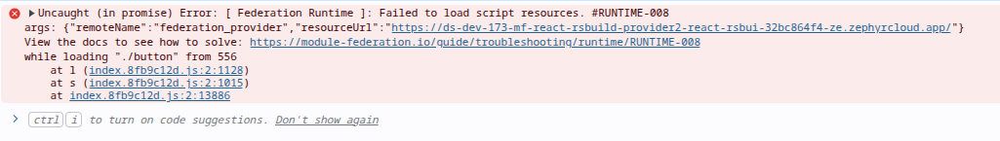
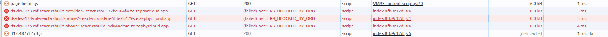
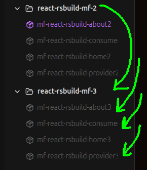
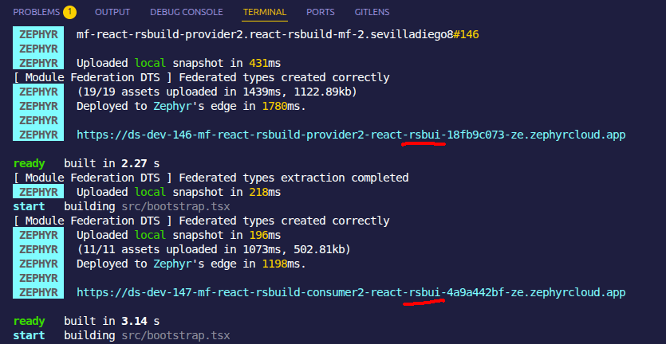
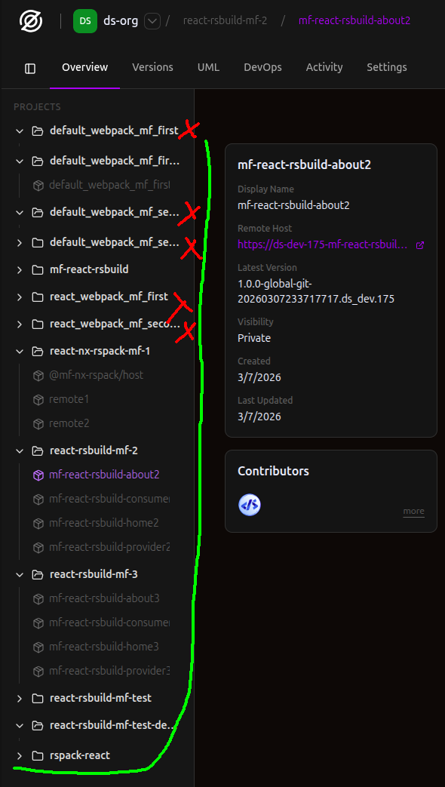

<h1 align="center">Zephyr Overview - Feedback<h1>


# Overview

Zephyr is a quite interesting tool because it helps solve different problems and complexities related to micro-frontends and module federation.

It provides a variety of features that make it easier to implement micro-frontends, such as:

- instant deployment
- dependency resolution
- seamless version management
- framework agnostic
- handles Module Federation configuration across multiple bundlers (Webpack, Vite, Rspack, Rollup, etc).

# Feedback

> I ran the tests of zephyr on a Dell notebook with `Ubuntu 24.04`and using Node.js v24.11.1, npm 11.6.2 and pnpm 10.30.3 respectively.

I executed various tests accross different bundler examples mentioned in Zephyr Docs | [Quick Start](https://docs.zephyr-cloud.io/getting-started/quick-start) | [Tutorials](https://docs.zephyr-cloud.io/tutorials/first-app) aiming to test the module federation features and discovered different things, some of them are:

## 1. [react-webpack-mf](https://github.com/ZephyrCloudIO/zephyr-examples/tree/main/vanilla/examples/mf-react-webpack)

I had a CORS problems when trying to run `app1` and `app2` apps locally for the `react-webpack-mf` example. The host (app1) can reach `mf-manifest.json`, but the remote server (app2) does not return CORS headers permitting `http://localhost:3001` to read it. As a result, the module federation runtime cannot consume the manifest, so lazy loading of `react_webpack_mf_second/App` fails. The solution for development is to add a wildcard or the following headers to the webpack dev server configuration within `app2`:
```js
devServer: {
  headers: {
    "Access-Control-Allow-Origin": "http://localhost:3001", // "*"
  }
}
```
Nevertheless, the solution for production is unclear to me at this moment. The example works locally after setting dev CORS correctly, but the deployed build still resolves the remote to `localhost`. I also noticed the github README of this example refers to an `app2Url` variable that does not exist in the current source, which makes the deployment instructions inconsistent with the repo. Since this reproduces from a fresh clean clone, it seems like an issue in the example, docs, or Zephyr’s webpack integration. 

## 2. [react-rsbuild-mf](https://github.com/ZephyrCloudIO/zephyr-examples/tree/main/vanilla/examples/mf-react-rsbuild)

I had a consistent/blocker bug 🐛🐛 testing this example. When I first cloned it, it deployed well to zephyr cloud, but once I started adding extra apps to consume them, I got these errors: 

<p align="center"> 
  
</p>
<p align="center"> 
  
</p>

The comsumer suddenly stopped loading the providers correctly for some reason. I built the apps again and checked wheteher everything was setup correctly and according to the docs, but i didn't make any progress. One solution I found to solve this was to rename my local `package.json` project name and the `providers` (apps) in order to generate a new project with fresh apps created in my zephyr cloud dashboard. 

<p align="center"> 
  
</p>


## 3. [mf-nx-rspack](https://github.com/ZephyrCloudIO/zephyr-examples/tree/main/nx/examples/mf-nx-rspack)

I didn't have any issues modifying the NX example, i was able to add more apps with no problem and deploy it to zephyr cloud. ✅✅

## 4.SSR

Zephyr does not currently present SSR for micro-frontends as a broadly supported, cloud-agnostic capability. In the future, it would be great to upgrade the `Cloudfare SSR Worker` to follow the previous statement. That is to work not only for cloudfare but also for other cloud providers such as AWS, Google Cloud, etc.

## 5. Automate mf configuration

I had to manually configure the Module Federation plugin in the rsbuild (webpack) configuration for all apps, which was a bit time-consuming and error-prone. It would be great if Zephyr could automate this process; something similar to what NX cli does when adding new apps to a repo with multiple apps

# Observations
1. I noticed the generated UIDs for the version urls of the apps have a stablished length which crops the url after modifying the name of my providers, consumers and applications with custom long names. It would be a good idea to mention that sticking to  short names is recommended for applications, projects and organizations.

<p align="center"> 
  
</p>


2. I realized that I can't delete folders in my organization. Since i did, several tests to understand the workflow I ended up with a messy org with a bunch of PROJECTS|Directories with test apps inside. I tried to get rid of some of them, but i was only able to delete the apps inside.

<p align="center"> 
  
</p>

# Conclusions

1. Zephyr is a very interesting tool that provides value by fast forwarding complexities and problems related to module-federation and micro-frontends, furthermore it completely removes the need to create ci/cd pipelines that deploy the apps automatically
2. Zephyr has first-class support for micro-frontends based on Module Federation applications. The docs offer micro-frontend guides about deploying MF apps, resolving remote dependencies, and managing versions/environments.
3. I discovered some issues that blocked me temporarily, but I might need to research zephyr internals better in order to understand the issues deeper.
4. I would probably stick to NX + Zephyr for a more fast forward setup of the apps, `less error prone` and module federation setup.
5. This public example doesn't have a `README.md` [mf-read-rsbuild](https://github.com/ZephyrCloudIO/zephyr-examples/tree/main/vanilla/examples/mf-react-rsbuild-1), adding a readme always serves as a guide to understand the example easier and better


