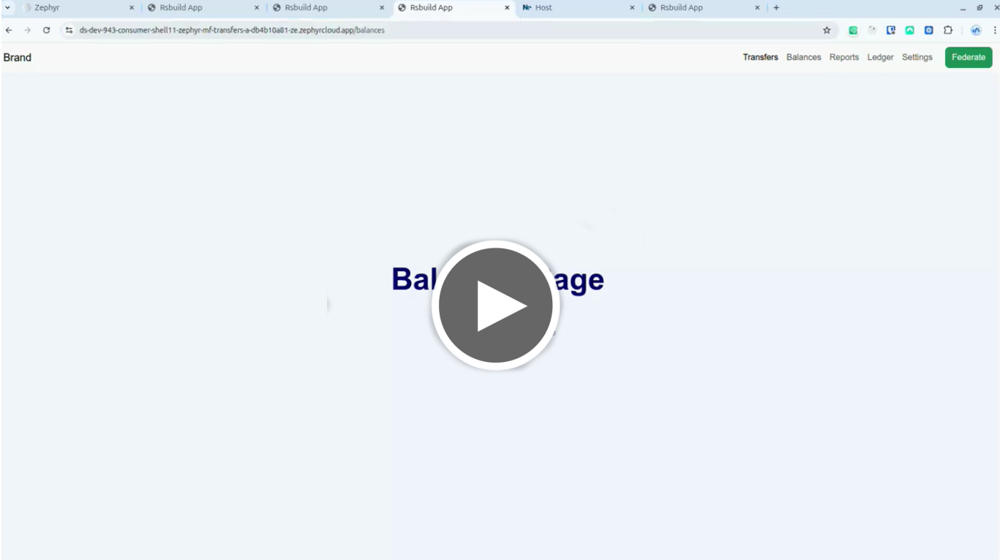

<h1 align="center">
 
  
 
 
Federated Transfers Demo App with Zaphyr, RsBuild and React  
</h1>
<h2 align="center" >Version 1.0</h2>

# Description

This repo features the usage of Zephyr, RsBuild and React in a project using module-federation for micro-frontends.

The example is basically a demo transfers app with different pages which can be independently deployed to zephyr cloud relying only on Zephyr’s default Cloud integration.

# Tools

- Zephyr Plugin 🚀 - 0.1.14
- RsBuild ✈️ - 1.6.0
- React 🌐 - 19.2.0
- TypeScript 📘 - 5.9.3
- Bootstrap 💄 - 5.3.8

# My Zephyr Feedback:

- [FEEDBACK](./R-FEEDBACK.md)

# Development

> You will need to create a zephyr account to manage your deployed applications

1. Install the necessary dependencies using `pnpm install`(recommended) or `npm install`.
2. Install dependecies in `root` directory
3. Install dependecies on each **app** by running `npm run install-deps`
4. run `pnpm run dev`

# Deployment

1. run `pnpm run build`

# References

- https://docs.zephyr-cloud.io/

# Deployed Apps (Links)

## Federated Transfers App with Zaphyr, NX, Rspack and React

- Consumer Shell - https://ds-dev-1141-consumer-zephyr-nx-mf-transfers-app-d-9cb842024-ze.zephyrcloud.app/
  - Transfers App - https://ds-dev-1140-transfers-zephyr-nx-mf-transfers-app--676bbb770-ze.zephyrcloud.app/
  - Balances App - https://ds-dev-1137-balances-zephyr-nx-mf-transfers-app-d-91b5a04ae-ze.zephyrcloud.app/
  - Reports App - https://ds-dev-1138-reportss-zephyr-nx-mf-transfers-app-d-e6dee4d62-ze.zephyrcloud.app/
  - Ledger App - https://ds-dev-1139-ledger-zephyr-nx-mf-transfers-app-dem-90885ff94-ze.zephyrcloud.app/
  - Settings App - https://ds-dev-1136-settings-zephyr-nx-mf-transfers-app-d-02ce4ef5d-ze.zephyrcloud.app

See repo here: [Federated Transfers App with Zaphyr, NX, Rspack and React Repo](https://github.com/sevilladiego8/zephyr-nx-mf-transfers-app-demo)

## Federated Transfers Demo App with Zaphyr, RsBuild and React 

> NOTE: the consumer app deployment has an issue and micro-frontends don't load at this moment. I might need to investigate more what is hapening since I built and tested the app serveral times. 

Watch the video demo: Navigation -> Zephyr Cloud Dashboard -> Shared UI

- Consumer Shell - https://ds-dev-950-consumer-shell11-zephyr-mf-transfers-a-d2557ebe6-ze.zephyrcloud.app/
  - Share UI APP - https://ds-dev-944-shared-ui-app11-zephyr-mf-transfers-ap-01320d867-ze.zephyrcloud.app/
  - Transfers App - https://ds-dev-945-transfers-app11-zephyr-mf-transfers-ap-fe02f382a-ze.zephyrcloud.app/
  - Balances App - https://ds-dev-946-balances-app11-zephyr-mf-transfers-app-40a7278be-ze.zephyrcloud.app/
  - Reports App - https://ds-dev-947-reports-app11-zephyr-mf-transfers-app--7d608ea37-ze.zephyrcloud.app/
  - Ledger App - https://ds-dev-948-ledger-app11-zephyr-mf-transfers-app-d-983993f85-ze.zephyrcloud.app/
  - Settings App - https://ds-dev-949-settings-app11-zephyr-mf-transfers-app-cd2ad3d94-ze.zephyrcloud.app/

## [NX Simple App](https://docs.zephyr-cloud.io/integrations/react-rspack-nx)