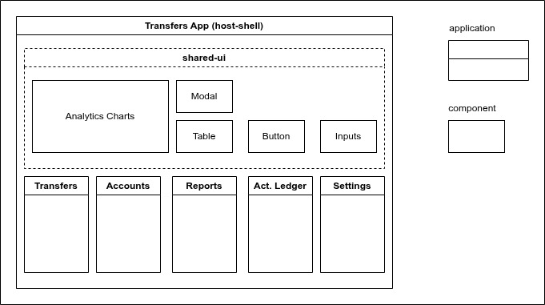

<h1 align="center">
 
  
 
 
Federated Transfers Demo App with Zaphyr, RsBuild and React  
</h1>
<h2 align="center" >Version 1.0</h2>

# Description 

This repo features the usage of Zephyr, RsBuild and React in a project using module-federation for micro-frontends. 

The example is basically a demo transfers app with different pages which can be independently deployed to zephyr cloud.

# Tools

- Zephyr Plugin 🚀 - 0.1.14 
- RsBuild ✈️ - 1.6.0 
- React 🌐 - 19.2.0
- TypeScript 📘 - 5.9.3
- Bootstrap 💄 - 5.3.8

# My Zephyr Feedback:
- [FEEDBACK](./R-FEEDBACK.md)

# Development

> You will need to create a zephyr account to manage your deployed applications

1. Install the necessary dependencies using `pnpm install`(recommended) or `npm install`.
2. Install dependecies in `root` directory
3. Install dependecies on each app `./apps/*`
4. pnpm run dev

# Deployment

1. pnpm run build

# References

- https://docs.zephyr-cloud.io/

# Links

## MF React Transfers Demo App

<video src="./imgs/react-rsbuild-mf-transfers.mp4" controls width="600"></video>

 - Consumer Shell - https://ds-dev-950-consumer-shell11-zephyr-mf-transfers-a-d2557ebe6-ze.zephyrcloud.app/
    - Transfers App - https://ds-dev-945-transfers-app11-zephyr-mf-transfers-ap-fe02f382a-ze.zephyrcloud.app/
    - Balances App - https://ds-dev-946-balances-app11-zephyr-mf-transfers-app-40a7278be-ze.zephyrcloud.app/
    - Reports App - https://ds-dev-947-reports-app11-zephyr-mf-transfers-app--7d608ea37-ze.zephyrcloud.app/
    - Ledger App - https://ds-dev-948-ledger-app11-zephyr-mf-transfers-app-d-983993f85-ze.zephyrcloud.app/
    - Settings App - https://ds-dev-949-settings-app11-zephyr-mf-transfers-app-cd2ad3d94-ze.zephyrcloud.app/
    - Share UI APP - https://ds-dev-944-shared-ui-app11-zephyr-mf-transfers-ap-01320d867-ze.zephyrcloud.app/

## [NX Simple App](https://docs.zephyr-cloud.io/integrations/react-rspack-nx)

- Host - https://ds-dev-156-mf-nx-rspack-host-react-nx-rspack-mf-1-6e713216c-ze.zephyrcloud.app/ 
  - Remote 1 - https://ds-dev-154-remote1-react-nx-rspack-mf-1-sevilladi-08d99aaad-ze.zephyrcloud.app/
  - REmote 2 - https://ds-dev-155-remote2-react-nx-rspack-mf-1-sevilladi-eb2c9e249-ze.zephyrcloud.app/
